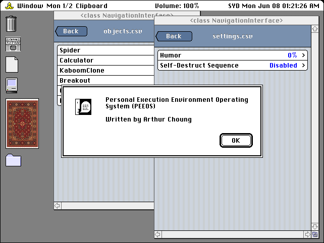
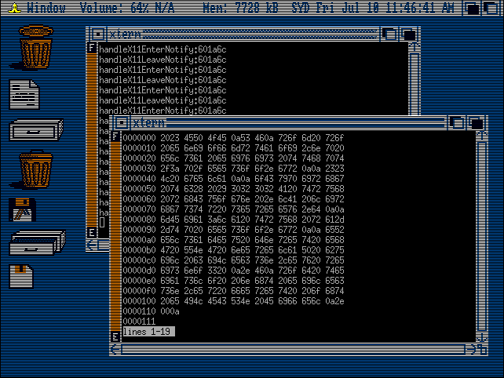

# PEEOS

Personal Execution Environment Operating System

For more information, please visit http://peeos.org

## Screenshots

## Overview

The design goals of PEEOS include:

  * Graphical user interface based on System 7.5 and earlier versions of Classic Mac OS
  * Custom lightweight Objective-C foundation
  * Bitmapped graphics, low DPI displays
  * Computation as opposed to communication
  * No Unicode support by design

At the moment it is based on Linux, mainly for the graphics drivers.

Inspiration is mostly taken from Classic Mac OS 7.5 and earlier versions, NeXT, Mac OS X (up to perhaps Tiger), and iOS (up to 6). There is also an Amiga mode, just for fun.

PEEOS uses a custom lightweight Objective-C foundation on top of the GNUstep Objective-C runtime. But it does not use the GNUstep Foundation. The style of Objective-C is completely different from the one Apple uses, everything is basically **id**.

By design, Unicode is not supported.

Low DPI displays are preferred, since the graphics are bitmapped and fixed in size. The preferred aspect ratio for PEEOS is 4:3. 

PEEOS does not use Automatic Reference Counting. It causes problems with type-checking during compilation (it is too strict).

## How to compile and run

$ sh makeExternal.sh

$ sh makeUtils.sh

$ perl build.pl

To run the window manager:

$ ./peeos runWindowManager

To run the iPod style interface:

$ ./peeos

## Legal

Copyright (c) 2020 Arthur Choung. All rights reserved.

Email: arthur -at- peeos.org

Released under the GNU General Public License, version 3.

For details on the license, refer to the LICENSE file.

