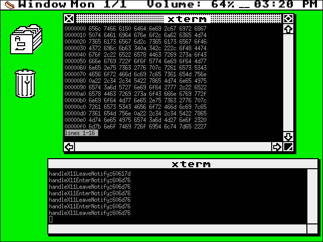
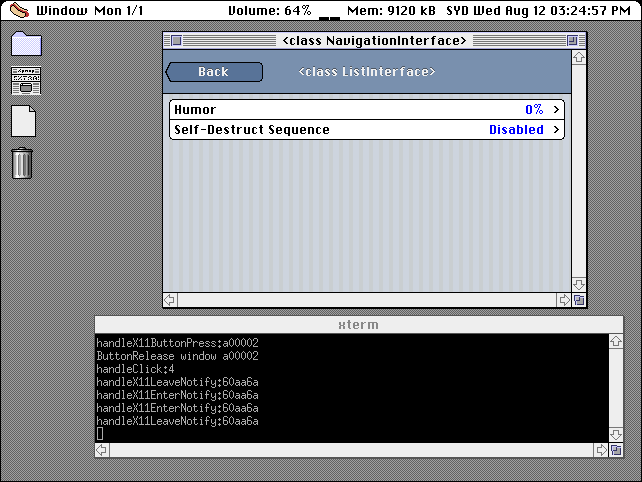
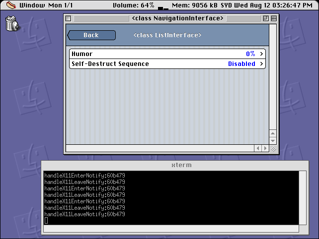

# HOT DOG Linux

For more information, please visit http://hotdoglinux.com

## Download

Live Image based on Slackware Live

http://hotdoglinux.com/download/

## Overview

The design goals of HOT DOG Linux include:

  * Graphical user interface based on retro computer systems including Hot Dog Stand (Windows 3.1), Amiga Workbench, Atari ST GEM, and Classic Mac
  * Custom lightweight Objective-C foundation
  * Bitmapped graphics, low DPI displays
  * No Unicode support by design

HOT DOG Linux uses a custom lightweight Objective-C foundation on top of the GNUstep Objective-C runtime. It does not use the GNUstep Foundation. The style of Objective-C is completely different from the one Apple uses, everything is basically **id**.

By design, Unicode is not supported.

Low DPI displays are preferred, since the graphics are bitmapped and fixed in size. The preferred aspect ratio for HOT DOG Linux is 5:4 in landscape, and 3:4 in portrait. 

HOT DOG Linux does not use Automatic Reference Counting. It causes problems with type-checking during compilation (it is too strict).

HOT DOG Linux is an acronym that stands for **H**orrible **O**bsolete **T**ypeface and **D**readful **O**nscreen **G**raphics for Linux.

## How to compile and run

$ sh makeUtils.sh

$ perl build.pl

To run the window manager:

$ ./hotdog runWindowManager

To run the iPod style interface:

$ ./hotdog

## Screenshots

Amiga Screenshot 1280x1024

Hot Dog Stand

Atari ST GEM

Mac Classic

Mac Color

Mac Platinum

## Legal

Copyright (c) 2020 Arthur Choung. All rights reserved.

Email: arthur -at- hotdoglinux.com

Released under the GNU General Public License, version 3.

For details on the license, refer to the LICENSE file.

